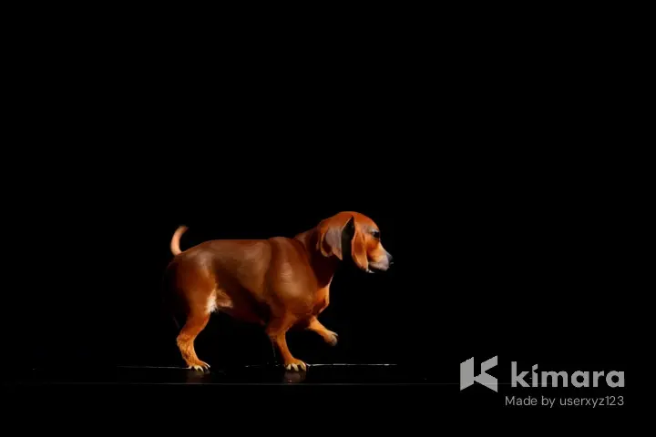

# Kimara.ai's Advanced Watermarking Tools

_**NOTE**: If you encounter any issues or errors, or have a suggestion for a feature, please create an issue on Github._

## Nodes

- Kimara.ai/KimaraAIWatermarker
- Kimara.ai/KimaraAIBatchImages

The **KimaraAIWatermarker** custom node allows you to apply watermark text and logo overlays to images and videos. Optionally, the watermark can be moved by the _move_watermark_step_ amount of pixels after each generated image.

## Features

- Add watermark text to images and videos.
- Add logo watermarks to images and videos.
- Move watermark across images in customizable steps.
- Adjust opacity of watermark image and text.
- Adjust size of the watermark image and font.
- Use custom fonts by setting the font path.\*
- Rotate watermark image.\*\*
- Batch processing for multiple images.

_\* When running ComfyUI in a container, the font path in /assets/fonts must be the full path from the workdir, e.g., custom_nodes/ComfyUI-Kimara-AI-Advanced-Watermarks/assets/fonts/DMSans-VariableFont_opsz,wght.ttf._

_\*\* Rotation currently only affects the watermark image._

### Input Parameters (KimaraAIWatermarker)

| Parameter               | Type               | Description                                                                                           |
| ----------------------- | ------------------ | ----------------------------------------------------------------------------------------------------- |
| `image`                 | `IMAGE`            | Input image / batch of images.                                                                        |
| `move_watermark`        | `BOOLEAN`          | Whether the watermark should move across the image.                                                   |
| `logo_image`            | `IMAGE` (optional) | The image to be used as the logo watermark. If not provided, an empty transparent image will be used. |
| `mask`                  | `MASK` (optional)  | The mask to apply to the logo image for transparency effects.                                         |
| `move_watermark_step`   | `INT`              | The number of pixels the watermark moves in each step (default: 10).                                  |
| `watermark_text`        | `STRING`           | The text to use as the watermark. If not provided, no text watermark will be applied.                 |
| `font`                  | `STRING`           | The font used for the watermark text (default: `assets/fonts/DMSans-VariableFont_opsz,wght.ttf`).     |
| `font_size`             | `INT`              | The font size for the watermark text (default: 16).                                                   |
| `logo_scale_percentage` | `INT`              | The percentage of the image width to scale the logo watermark (default: 25).                          |
| `x_padding`             | `INT`              | Horizontal padding for watermark positioning (default: 20).                                           |
| `y_padding`             | `INT`              | Vertical padding for watermark positioning (default: 20).                                             |
| `rotation`              | `INT`              | The rotation angle of the watermark (default: 0).                                                     |
| `opacity`               | `FLOAT`            | The opacity of the watermark (0 is fully visible, 100 is fully transparent).                          |

### Output (KimaraAIWatermarker)

| Parameter | Type   | Description         |
| --------- | ------ | ------------------- |
| `IMAGES`  | `LIST` | Image(s) in a list. |

#### License

This project is licensed under the **GNU Affero General Public License v3.0**. See the [LICENSE](./LICENSE) file for details.
